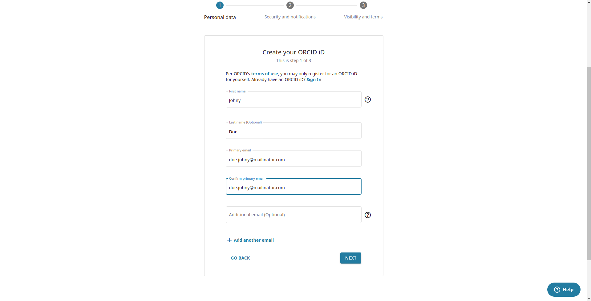
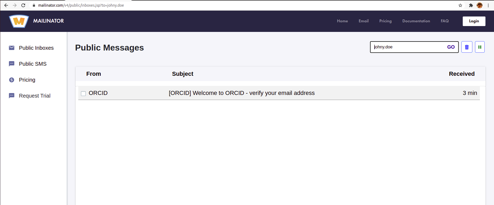
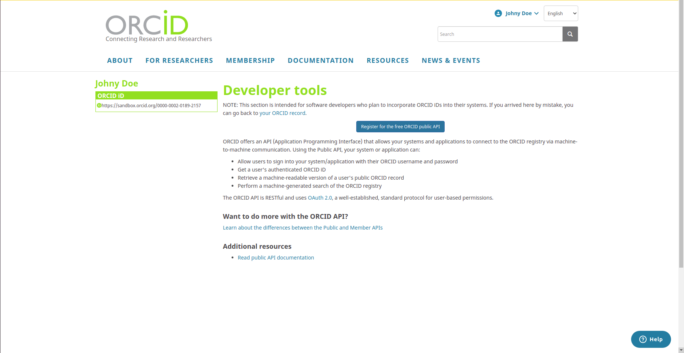
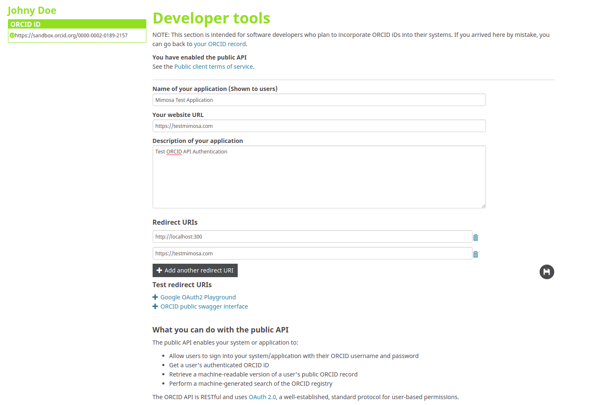
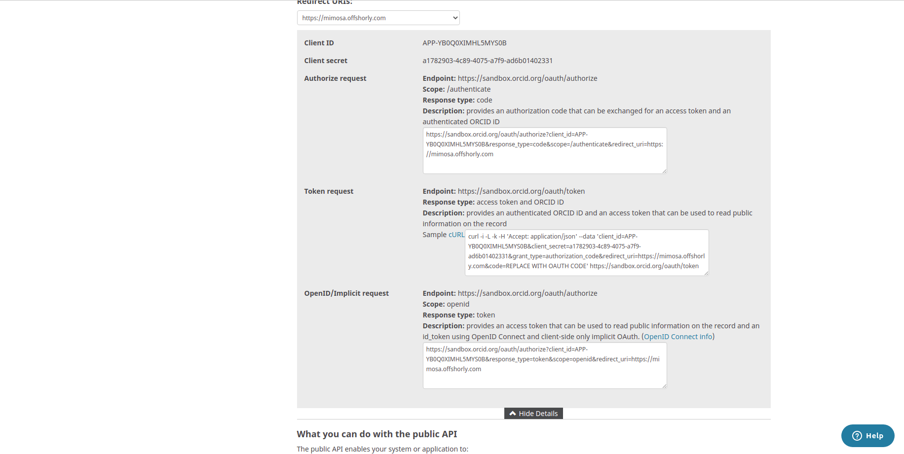

## MIMOSA FRONTEND

### NOTE:
Setup and run backend first before running frontend application. 

### Requirements

1. Node - Download and install Node.js in https://nodejs.org/en/download
2. Yarn 
- (LINUX or macOS) - Run sudo npm install --global yarn
- (Windows OS) - Open CMD and Run as Administrator. Run npm install --global yarn
3. Git - Download and install Git in https://git-scm.com/downloads. For macOS you might need to install homebrew and follow the steps on the link in your terminal.

### Setup Project Dependencies

1. Open Terminal and clone `git clone https://github.com/Mimosa-Development-Team/mimosa-frontend.git && cd mimosa-frontend`
2. Run **`yarn install`**
3. If there's an error on`react-scripts is not yet install`. Run **`yarn add react-scripts`**

### Orcid Configuration

** SANDBOX **

1. Register or signin to `https://sandbox.orcid.org/signin`. <br />You can use any email with @mailinator.com. ex: `john.doe@mailinator.com`<br />

2. Verify your registered email in `https://www.mailinator.com/v4/public/inboxes.jsp?to=18646713693`
    Note: search your registered email in mailinator site under Public Inboxes. If result not found, click resend email verification in your sandbox account.<br />

3. Open your sandbox account and select Developer tools under your Profile Menu.
4. Click on Register for the free ORCID public API button, check consent and continue to fill up the forms.<br />

5. Fill up the form with the name of your application, website URL, and Description of your application <br />

6. For redirect URIs field, input http://localhost:3000. You may also add multiple URIs if you want Orcid to have multiple authorize domain.
7. Click the save file icon.
8. Open again the Developer tools under your Profile Menu and select the public API you created.<br />

9. If you'll use it on your local. Select the http://localhost:3000 on Redirect URIs selection. Copy the OpenID/Implicit request url without including the url at the end. ex: `https://sandbox.orcid.org/oauth/authorize?client_id=APP-JLNPEZN4CGRFJS41&response_type=code&scope=/authenticate&redirect_uri=`
10. Open and edit .env file in project directory and paste the OpenID/Implicit request url to `REACT_APP_ORCID=` and save. Example below:
```
REACT_APP_BACKEND_URL=http://localhost:9000
REACT_APP_ORCID=https://sandbox.orcid.org/oauth/authorize?client_id=APP-JLNPEZN4CGRFJS41&response_type=code&scope=/authenticate&redirect_uri=
```

** PRODUCTION **

1. Register or signin to `https://orcid.org/signin`. You have to use a valid email for verification. <br />

2. Verify to your registered email.
3. Open your sandbox account and select Developer tools under your Profile Menu.
4. Click on Register for the free ORCID public API button, check consent and continue to fill up the forms.<br />

5. Fill up the form with the name of your application, website URL, and Description of your application <br />

6. For redirect URIs field, input `https://openmimosa.org`. You may also add multiple URIs if you want Orcid to have multiple authorize domain.
7. Click the save file icon.
8. Open again the Developer tools under your Profile Menu and select the public API you created.<br />

9. Select the URL you want to use on Redirect URIs selection. Copy the OpenID/Implicit request url without including the url at the end. ex: `https://sandbox.orcid.org/oauth/authorize?client_id=APP-JLNPEZN4CGRFJS41&response_type=code&scope=/authenticate&redirect_uri=`
10. Open and edit .env file in project directory and paste the OpenID/Implicit request url to `REACT_APP_ORCID=` and save. Example below:
```
REACT_APP_BACKEND_URL=http://openmimosa.org
REACT_APP_ORCID=https://orcid.org/oauth/authorize?client_id=APP-JLNPEZN4CGRFJS41&response_type=code&scope=/authenticate&redirect_uri=
```

Note: for additional reference, you may refer to Orcid's documentation here: https://info.orcid.org/documentation/api-tutorials/api-tutorial-get-and-authenticated-orcid-id/#easy-faq-2719

### Run/Start Project

1. Run **`yarn start`** on terminal inside your project folder to start a local build of the project.

#### Production

1. Run **`yarn build`** to create a production build. The final output will be located in a **`/build`** folder.

---

### Folder Structure

The project contains the following tree structure:

```
/src
  /assets - contains the project’s assets that are used throughout the application.
    /icons - contains all custom icons (since this repo has fontawesome icons)
    /images - contains all images
  /components - contains all reusable components
    /controls - contains all reusable input fields and input fields custom styles
  /global - contains all global variables and styles
    /styles - contains the global styles
  /pages - contains all containers that represent a React Route
  /store - contains the global state of the webapp
  /utils - contains utility functions
```

---

### Coding Conventions

- This project follows functional paradigm and is built only with functional components using React hooks

- Each component is put into a folder named the same as we would like to call the component (ex: **Button**)

- The component is written in an **`index.js`** file and it’s styles are written as **`styles.module.scss`** (CSS Modules are used for styling)

- If there are additional files that are needed for the component (animations, tests) they are put into their own folders inside the component’s folder.

  **Example:**

  ```
  /Button
    /animations
      index.js
    /tests
      index.test.js
    index.js
    styles.module.scss
  ```

- If a particular component is only used and only makes sense inside another component (For example we want to divide a component into multiple subcomponents for readability) then we create another **`components`** folder inside the parent and create the component there.

  **Example:**

  ```
  /Header
    /components
      /HeaderPromo
        index.js
        styles.module.scss
    index.js
    styles.module.scss
  ```

- Use named exports instead of default exports

- Use absolute path as much as possible

- Use relative path only if the maximum distance is 2 directories

- When importing global styles inside other sass files use absolute paths: **`@import '~global/styles'`**

---

### Linting

#### Eslint

This project uses Airbnb's eslint config, react-hooks config and prettier config.

Install and configure an ESLint plugin for your IDE to be able to see all eslint errors.

All customized rules are inside **`.eslintrc`**.

All files that should be ignored by eslint are specified inside **`.eslintignore`**.

#### Stylelint

Stylelint is used for linting the CSS.

Install a stylelint plugin in your IDE to be able to see all potential errors.

All rules can be found inside **.stylelintrc** file.

---

Code with linting errors should not be pushed to repositories. For that reason a pre-hook is attached that checks for any linting errors when committing.

If you find a certain rule to be invaluable and make the code worse, talk with the team to potentially get it disabled.

---

### Committing Conventions

- When committing do not use capital letters
- Commit messages should always start with `task:`, `feature:`, or `fix:` (e.g `task: create homepage`)
- When doing a feature always create a merge request branch (e.g feature/homepage)

### Dependencies

- **react-router-dom** (page routing)
- **react-query** (storing server side data)
- **hookstate.js** (storing client side data)
- **axios** (http requests)
- **css-modules** (styling)
- **react-bootstrap** (components & styling)
- **autoprefixer** (no need to add vendor prefixes when styling)
